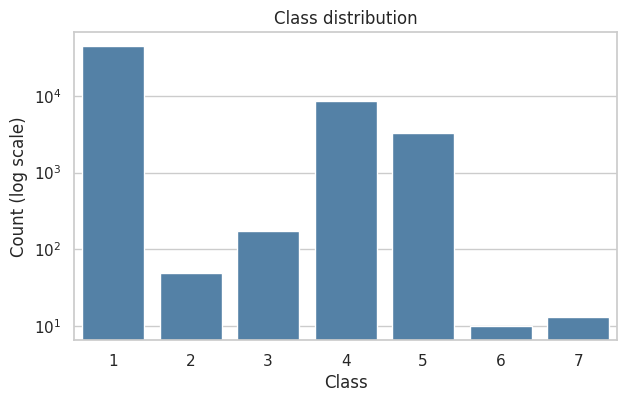
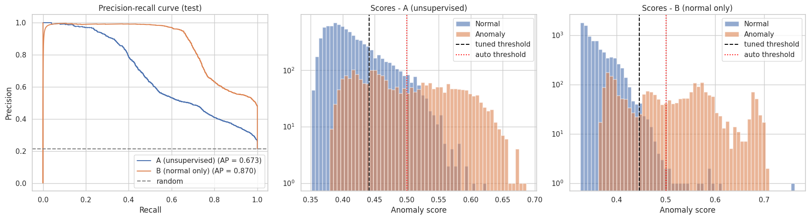
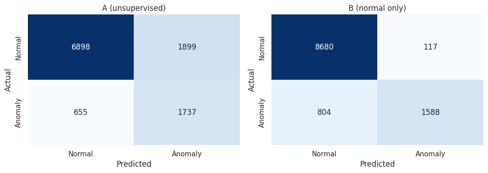

# NASA Shuttle Anomaly Detection — Isolation Forest

Anomaly detection on the **Statlog (Shuttle)** dataset with scikit-learn's
**Isolation Forest**. Class 1 is the normal flight state (~79% of the data). Classes 2–7 are
rare states and are treated as anomalies.

This repository holds my part of a team Machine Learning mini project at ESI-SBA: the
Isolation Forest model. The complete project compares several detectors (Isolation Forest,
Local Outlier Factor, One-Class SVM) and serves them in a Streamlit diagnostic app. You can find it here:

**➡️ Full project: [S4afou/shuttle-nasa-ML](https://github.com/S4afou/shuttle-nasa-ML)**

---

## Highlights

- Best model: **anomaly F1 = 0.775**, **PR-AUC = 0.870**, **accuracy = 0.918**. An "always
  normal" baseline gets 0.786 accuracy.
- Two training settings compared: **fully unsupervised** and **trained on normal data only**.
- Hyperparameters selected on a validation set using **PR-AUC**, a threshold-free metric
  that copes with class imbalance better than accuracy.
- Decision threshold tuned on validation, then a single evaluation on a held-out test set.
- Seed-stability check over 5 random seeds.

## Dataset and preprocessing

[Statlog (Shuttle)](https://www.openml.org/d/40685), loaded with `fetch_openml("shuttle")`.

- Drop `A1`, the time attribute.
- Remove 2,059 duplicate rows **before splitting**, so the same row can't appear in both train
  and test. This leaves **55,941 samples × 8 features** and **21.38%** anomalies.
- Stratified split on the original class, **60 / 20 / 20** (train / validation / test), so the
  very rare classes 6 and 7 appear in every split.
- No feature scaling. Isolation Forest picks split values between each feature's min and max,
  so scaling doesn't change the result.



## Method

**Two training settings**

- **A — unsupervised:** trained on all training rows, labels unused.
- **B — normal only:** trained only on class-1 training rows. This makes the approach
  semi-supervised, but normal operation data is easy to collect for this kind of telemetry.

**Hyperparameter search** (`n_estimators` ∈ {100, 300}, `max_samples` ∈ {256, 0.25, 1.0},
`max_features` ∈ {0.5, 1.0}). Each configuration is ranked by validation PR-AUC.

| Setting | Best parameters | Val. PR-AUC |
|---|---|---|
| A (unsupervised) | `n_estimators=300, max_samples=256, max_features=0.5` | 0.666 |
| B (normal only) | `n_estimators=300, max_samples=1.0, max_features=1.0` | 0.860 |

**Thresholds.** Two thresholds are compared for each setting: the default one from
`contamination="auto"`, which needs no labels, and the one that maximizes anomaly F1 on the
validation set.

## Results on the test set

| Model | Threshold | PR-AUC | ROC-AUC | Precision | Recall | F1 (anomaly) | Accuracy |
|---|---|---|---|---|---|---|---|
| Baseline (always normal) | – | 0.214 | 0.500 | 0.000 | 0.000 | 0.000 | 0.786 |
| A (unsupervised) | auto | 0.673 | 0.846 | 0.721 | 0.441 | 0.547 | 0.844 |
| A (unsupervised) | tuned | 0.673 | 0.846 | 0.478 | 0.726 | 0.576 | 0.772 |
| B (normal only) | auto | 0.870 | 0.951 | **0.988** | 0.497 | 0.661 | 0.891 |
| **B (normal only)** | **tuned** | **0.870** | **0.951** | 0.931 | **0.664** | **0.775** | **0.918** |





**Detection rate per class** on the test set, with the tuned threshold. For class 1 this is
the false-positive rate.

| Class | Test rows | A (unsupervised) | B (normal only) |
|---|---|---|---|
| 1 (normal) | 8797 | 21.6% | **1.3%** |
| 2 | 10 | 90.0% | 70.0% |
| 3 | 34 | 100% | 76.5% |
| 4 | 1698 | 61.5% | 53.3% |
| 5 | 646 | 100% | 100% |
| 6 | 2 | 100% | 100% |
| 7 | 2 | 100% | 100% |

**Seed stability** (5 seeds, test set):

| Setting | PR-AUC (mean ± std) | F1 anomaly (mean ± std) |
|---|---|---|
| A (unsupervised) | 0.649 ± 0.017 | 0.555 ± 0.004 |
| B (normal only) | 0.860 ± 0.007 | 0.767 ± 0.007 |

## Takeaways

- Accuracy is misleading here: the trivial baseline already reaches 78.6%. PR-AUC and anomaly
  F1 are the meaningful metrics.
- Training on normal data only (B) is clearly better. It gives +0.20 PR-AUC and +0.20 F1, and
  it cuts the false-positive rate from 21.6% to 1.3%.
- Class 4, the largest anomaly class, is the hardest to separate: its points lie close to
  the normal cluster. Classes 5, 6 and 7 are always detected.
- The `auto` threshold needs no labels at all. The tuned threshold needs a small labelled
  validation set but raises recall from 0.50 to 0.66.

## Run it

```bash
pip install -r requirements.txt
jupyter notebook isolation_forest_shuttle.ipynb
```

The dataset is downloaded automatically from OpenML.

## Repository structure

```
├── isolation_forest_shuttle.ipynb   # full notebook with outputs
├── figures/                         # plots exported from the notebook
└── requirements.txt
```

## Author

**Ines Aini**, ESI-SBA (École Supérieure en Informatique, Sidi Bel Abbès)
